# metamon

## Minjung Kim, Hyungsuk Lim, Yeongjoon Park,Yesuel Joo

[Korean discription](http://cscp2.sogang.ac.kr/CSE4187/index.php/%ED%8A%B8%EB%A0%88%EC%9D%B4%EB%84%88)

## Introduction
Metamon is a program that makes a picture of a person's face by entering the image of the border sketch of the person's face and the text information that shows the characteristics of the face. A typical sketch might have been uncomfortable when a person or program was used to map a person's features in detail. This process is limited not only because it is very complex and requires technicians, but also because it creates a feeling of incompatibility with real people. But with Metamon, you don't have to draw a human figure in detail ; you have to just draw a simple border, and you have to visualize the features of the face, and you have to capture them in text.

## Implement
### 0. Dataset
The project uses Sketch to create realistic facial images, so use [CelebA](http://mmlab.ie.cuhk.edu.hk/projects/CelebA.html) as a dataset. 

CelebA is the CelebFaces Attributes Dataset (CelebA). CelebAdataset has 202,599 face images, and each face image contains 40 binary attributes. Binary attachment means an attribute for each bit, and if the image has no attachment, it is represented as - 1. 

In this model, we considered limiting the actual image to the human face, and because each country has five landmarks, learning to have different facial characteristics is also considered. Each of the Cele bA dataset images contains a variety of attribute images.

### 1. Data preprocessing
#### Generate Sketch Image
To change the Sketch image into a realistic one, need to train the Pix2Pix model using the Generative Adversarial Network. 

We extracted Sketch from the photos of the CelebA dataset and concatenate the picture of CelebA dataset and Sketch images to organize the pictures shown in Figure 1 to training Pix2Pix model.

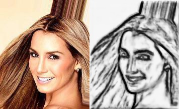

The model used for extracting Sketch image was the Holistically-Nested Edge Detection [HED](https://github.com/zeakey/hed) by UC San Diego. 

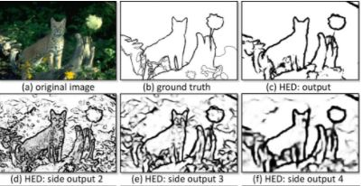

#### Text Processor
The text information processor is responsible for processing the input text to use as an attachment. Text that is typed is filtered into the string, so it is parsing the appropriate word, and then calculate similarity between input text and 40 attributes that given by CelebA dataset using Jaro Winkler distance .Then similarity matches with the attribute that has biggest similarity and concatenates with the results that followed the encoding of the entered sketch image.
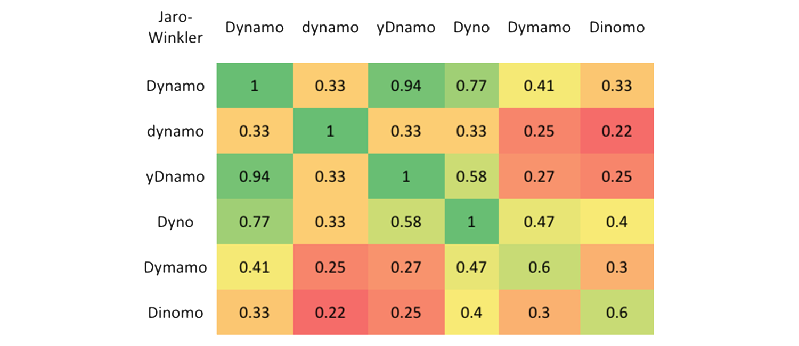

### 2. Model Implement
#### [Pix2Pix](https://github.com/phillipi/pix2pix)
The image generating model used by the project is based on Pix2Pix nodel.

First Pix2Pix, the resulting images are created by coloring the sketch image along with the Generator composed of Auto encoder upon receipt of the sketch image as input.

After that, Discriminator evaluates whether the the result image is a real picture or a photo genrated one, and determines that the result is a real picture from dataset, The genrator produces an image to trick the discriminator, and the discriminator trains by determining where the image generated comes from.

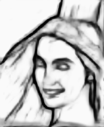
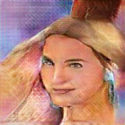

### [StarGAN](https://github.com/yunjey/StarGAN)
Output images produced by applying the sketch image to the Pix2 Pix model and attribute information obtained by passing the user-inputted text information through a text processor are entered into Stargand model.
StarGan models also generate images through Generator (G), as does the Pix2pix model. The difference is that additional attribute information is input with the input image to create a photo-like image that reflects hair color, beard, and whether or not glasses are worn. 

Similarly, a Discriminator (D) evaluates whether the resulting image is a real picture or a photo-generated one. 
The generator produces an image to fool the discrimnator, and the discriminator makes a judgment on where the input attribute information comes from and where it came from.

### Flow
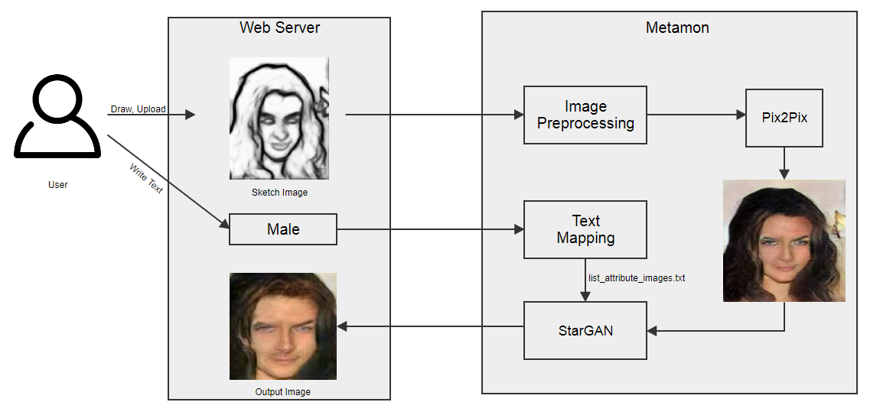

### Demo
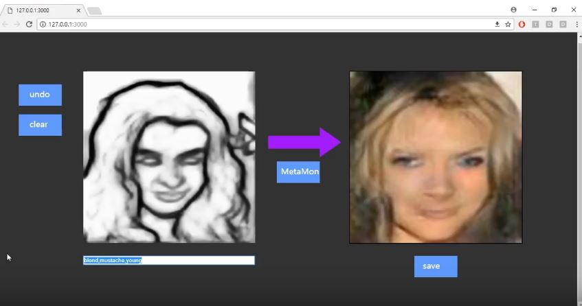
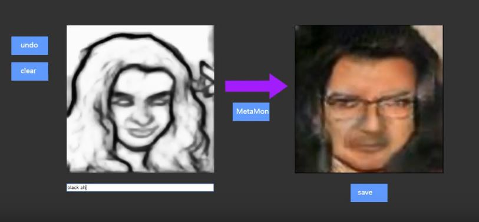
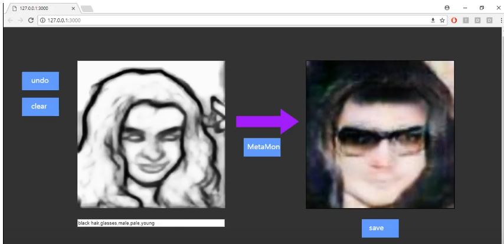
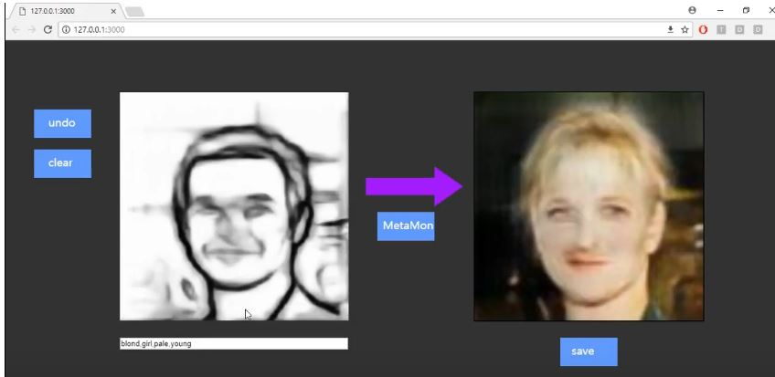
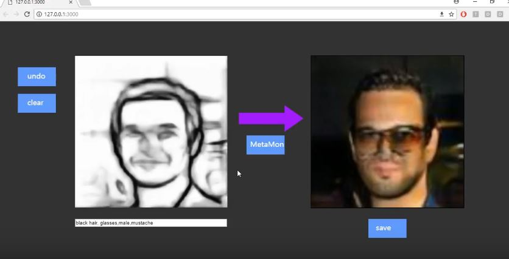
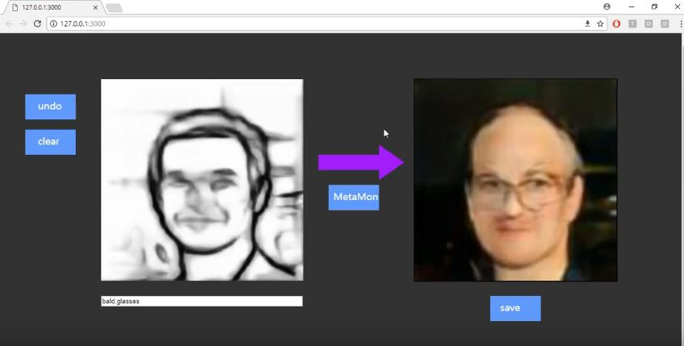

